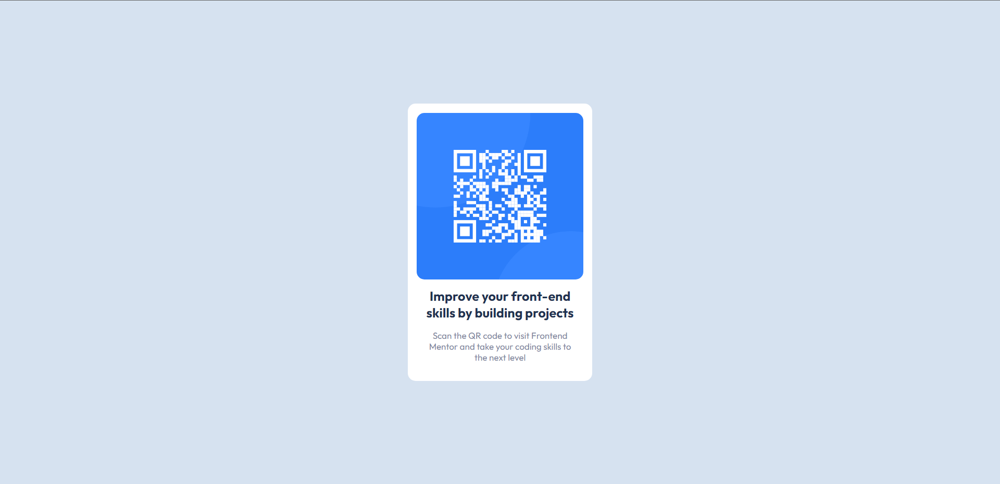

# Frontend Mentor - QR code component solution

This is a solution to the [QR code component challenge on Frontend Mentor](https://www.frontendmentor.io/challenges/qr-code-component-iux_sIO_H). Frontend Mentor challenges help you improve your coding skills by building realistic projects. 

## Table of contents

- [Overview](#overview)
  - [Screenshot](#screenshot)
  - [Links](#links)
- [My process](#my-process)
  - [Built with](#built-with)
  - [What I learned](#what-i-learned)
  - [Continued development](#continued-development)
  - [Useful resources](#useful-resources)
- [Author](#author)
- [Acknowledgments](#acknowledgments)

**Note: Delete this note and update the table of contents based on what sections you keep.**

## Overview

This project is easy. I could do it while pulling an all-nighter. Honestly, the hardest part was centering the div. It seems like I'm always relearning how to do that all over again.

### Screenshot

### Links

- [Solution](https://www.frontendmentor.io/solutions/qr-code-challenge-just-htmlcss-72x7HRy9NF)
- [Live Site](https://adrianesantosdev.github.io/qr-code-challenge/src/)

## My process

First, I created the HTML and set up the divs and text. Then, I used colors to create variables in the CSS file. I did stumble a bit with the font size, though.

### Built with

- Semantic HTML5 markup
- CSS custom properties
- Flexbox

### What I learned

How to center a div (again)

### Im going to update the links soon
### Author

- Website - [Add your name here](https://www.your-site.com)
- Frontend Mentor - [@AdrianeSantosDev](https://www.frontendmentor.io/profile/yourusername)
